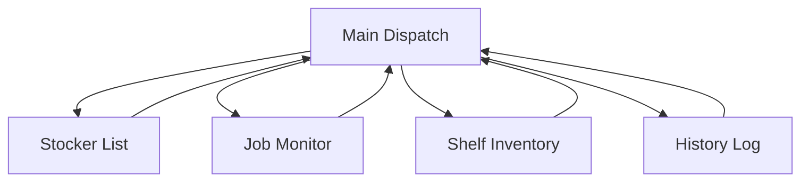
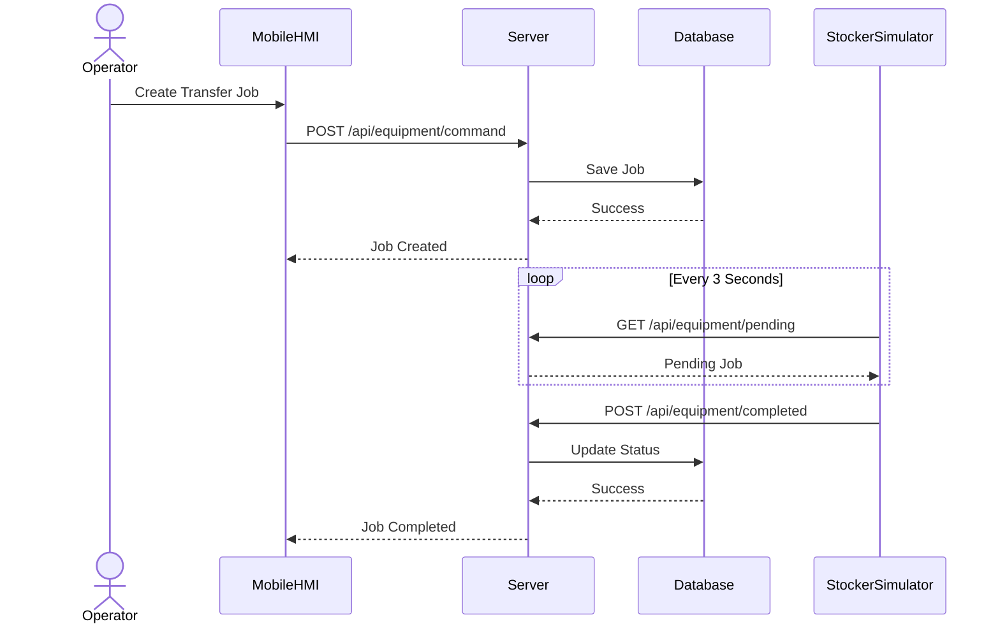
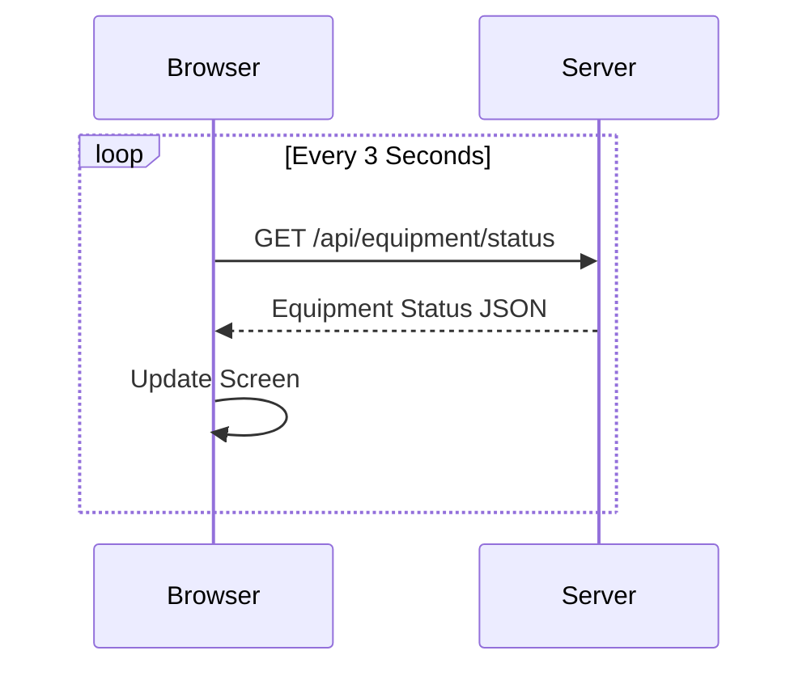
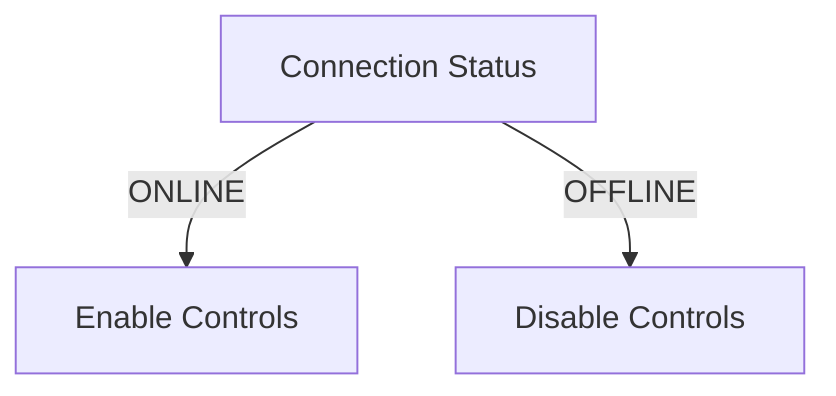
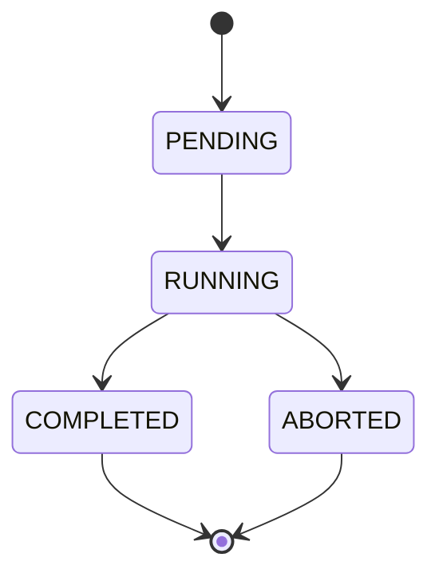

# AMHS Stocker Monitoring & Control System

## Project Overview

This project is a semiconductor AMHS (Automated Material Handling System) simulator developed using ASP.NET Core Razor Pages.

The system simulates a stocker controller that manages carrier transportation jobs, stocker monitoring, inventory tracking, and operation history logging.

The application is optimized for smartphone operation and follows a Progressive Web App (PWA) architecture.

---

# System Architecture

```text
+------------------------------------------------+
|            Smartphone Operator HMI             |
|          (ASP.NET Core Razor Pages)            |
+------------------------+-----------------------+
                         |
                         | REST API
                         v
+------------------------------------------------+
|            Stocker Controller Server           |
|            ASP.NET Core Web API                |
+------------------------+-----------------------+
                         |
                         |
                         v
+------------------------------------------------+
|                 SQL Database                   |
+------------------------------------------------+

                         ^
                         |
                         |
                 3 sec Polling

+------------------------------------------------+
|           Stocker Simulator Console            |
|             Equipment Emulator                 |
+------------------------------------------------+
```

---

# Technology Stack

| Category       | Technology   |
| -------------- | ------------ |
| Backend        | ASP.NET Core |
| Frontend       | Razor Pages  |
| UI             | Bootstrap 5  |
| Client Script  | JavaScript   |
| Database       | SQL Server   |
| Communication  | REST API     |
| Mobile Support | PWA          |
| Diagram        | Mermaid      |

---

# Functional Requirements

| ID    | Function                    |
| ----- | --------------------------- |
| F-001 | Equipment Status Monitoring |
| F-002 | Transfer Dispatch           |
| F-003 | Alarm Notification          |
| F-004 | Job Monitoring              |
| F-005 | Shelf Inventory Monitoring  |
| F-006 | History Log Monitoring      |
| F-007 | Safety Interlock            |
| F-008 | Main Dispatch Screen        |
| F-009 | Stocker Registry Screen     |

---

# Screen Structure



---

# System Workflow



---

# Equipment Status Polling

The mobile terminal continuously monitors equipment status.

Polling Interval:

```text
3000ms
```



---

# Safety Interlock Logic

If a stocker enters OFFLINE state:

* DISPATCH button disabled
* START button disabled
* STOP button disabled



---

# Job Lifecycle



---

# Inventory Management

Shelf status is managed using Occupied flags.

| Occupied | Meaning         |
| -------- | --------------- |
| true     | Carrier Present |
| false    | Empty Shelf     |

---

# API Overview

## Equipment APIs

```http
GET /api/equipment/status
POST /api/equipment/command
GET /api/equipment/pending
POST /api/equipment/completed
```

## Stocker APIs

```http
GET /api/stockers
```

## Job APIs

```http
GET /api/jobs/active
DELETE /api/jobs/{id}
```

## Inventory APIs

```http
GET /api/inventory/shelves
```

## History APIs

```http
GET /api/logs/recent
```

---

# Project Structure

```text
Pages
│
├── Index.cshtml
├── Stockers.cshtml
├── Jobs.cshtml
├── Shelves.cshtml
├── History.cshtml
│
├── Shared
│   └── _Layout.cshtml
│
wwwroot
│
├── js
│   └── amhs-core.js
│
├── manifest.json
│
└── sw.js
```

---

# Team Responsibilities

## Frontend

* Razor Pages
* Bootstrap UI
* Mobile Layout
* JavaScript Polling
* API Integration
* Error Handling
* PWA Configuration

## Backend

* REST API Development
* Business Logic
* Database Access
* Job Scheduling
* Equipment Communication

## Simulator

* Stocker Equipment Emulator
* Polling Implementation
* Job Execution Simulation

---

# Future Improvements

* SEMI E84 Simulation
* SECS/GEM Integration
* Multi-Stocker Support
* AGV Integration
* Alarm Management
* Real-time WebSocket Monitoring

---
