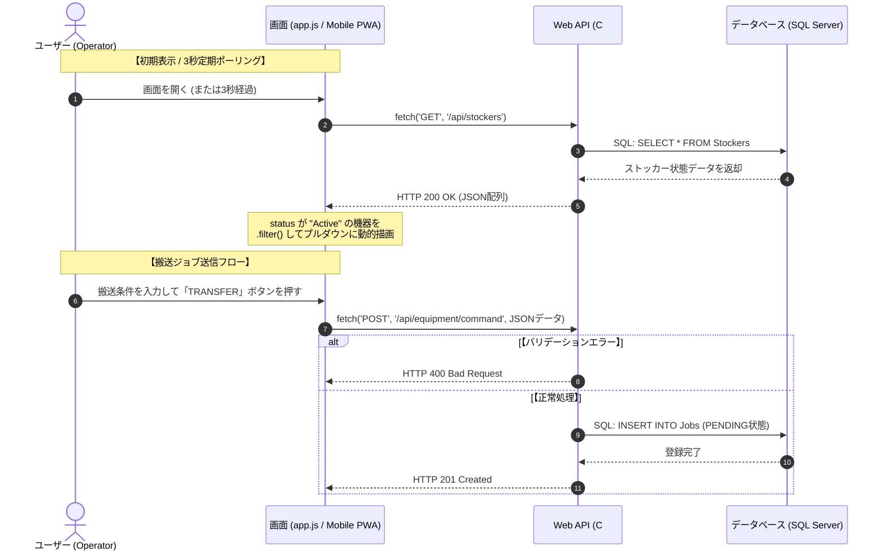

### 2. Processing Sequence (Screen Display & Registration Flow)

```mermaid
sequenceDiagram
    autonumber
    actor User as ユーザー (Operator)
    participant UI as 画面 (app.js / Mobile PWA)
    participant API as Web API (C# / ASP.NET)
    participant DB as データベース (SQL Server)

    %% --- INITIAL DISPLAY ---
    Note over User, UI: 【初期表示 / 3秒定期ポーリング】
    User->>UI: 画面を開く (または3秒経過)
    UI->>API: fetch('GET', '/api/stockers')
    API->>DB: SQL: SELECT * FROM Stockers
    DB-->>API: ストッカー状態データを返却
    API-->>UI: HTTP 200 OK (JSON配列)
    Note over UI: status が "Active" の機器を<br/>.filter() してプルダウンに動的描画

    %% --- JOB DISPATCH FLOW ---
    Note over User, UI: 【搬送ジョブ送信フロー】
    User->>UI: 搬送条件を入力して「TRANSFER」ボタンを押す
    UI->>API: fetch('POST', '/api/equipment/command', JSONデータ)
    
    alt 【バリデーションエラー】
        API-->>UI: HTTP 400 Bad Request
    else 【正常処理】
        API->>DB: SQL: INSERT INTO Jobs (PENDING状態)
        DB-->>API: 登録完了
        API-->>UI: HTTP 201 Created
    end
```
